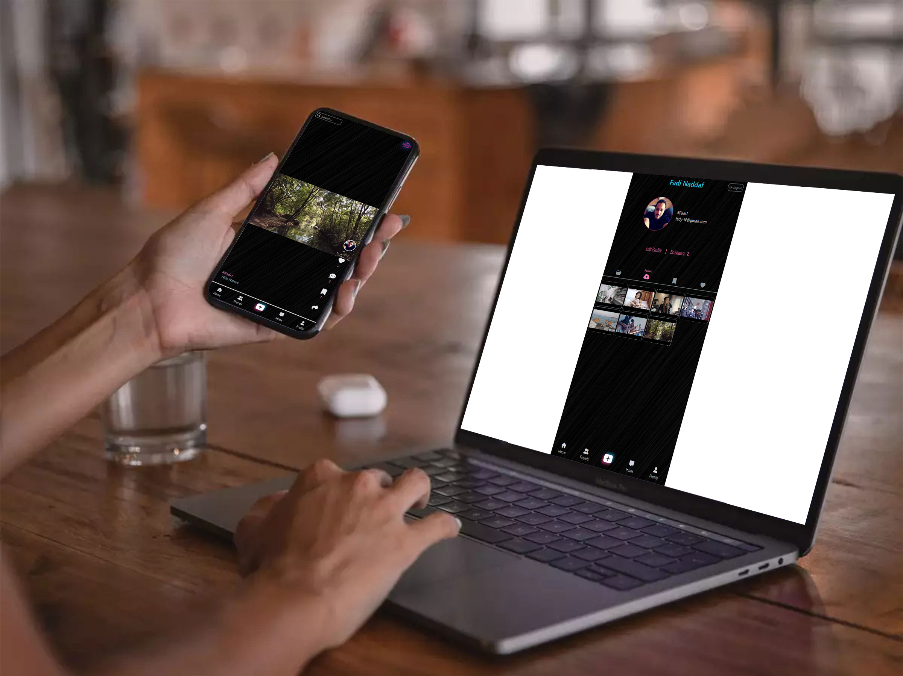
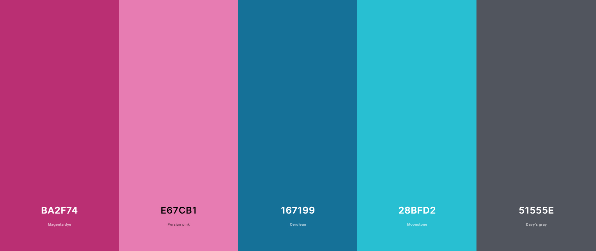

<br>

## 1. Overview

CRAC is an alternative to TikTok, providing a platform for users to create and share short video clips.

The name _CRAC_ stands for:

- C : Camera <br>
- R : Roll <br>
- A : Action <br>
- C : Cut <br>

<br>

## 2. Description

CRAC aims to offer users a user-friendly and entertaining experience for creating and sharing short video content. Users can record videos, add effects, edit their clips, comment on other users' videos, follow users, save or favorite other users' videos, and share them with the CRAC community.

<br>
The project provides the following features:
<br>
<br>

**<p style="color: #c9ab67">1. User Registration and Authentication:</p>**

Users can create accounts and log into the platform using traditional registration or Google authentication. Additionally, verifying user phone number by receiving a verification code via SMS. These processes enable users to personalize their experience, engage with other users, and access various platform features.

<br>

**<p style="color: #c9ab67">2. Video Creation and Editing:</p>**

CRAC provides a camera interface for users to record videos. Users can add sound effects or uploading a short videos.

<br>

**<p style="color: #c9ab67">3. Social Interactions:</p>**

Users can follow other users, like videos, leave comments, share a video via social media and engage in discussions. This fosters a sense of community and encourages collaboration among users.

<br>

**<p style="color: #c9ab67">4. Notifications:</p>**

Users can receive notifications about interactions on their videos, such as likes, followers, and comments. Additionally, they have the ability to view the online status of other users.

<br>

## 3. Link and Preview



Project link is available at [CRAC App](https://fashion-client.onrender.com/)

<br>

## 4. Color guide



<br>

## 5. Built with

<p align="left">


</p>

<br>
<br>

## 6. Project Setup

To set up the CRAC project, follow these steps:

<br>

1. Navigate to the main directory of the project.

2. Run the command `npm install` to install the necessary dependencies for both the server and client components.

3. After the dependencies are installed, run `npm run setup` to ensure all the required configurations are in place.

4. To run the application in development mode, use the command `npm run dev`. This will start the server and client components concurrently, allowing you to test and interact with the CRAC platform locally.

<br>

Please note that additional configuration steps and requirements may exist. Refer to the project documentation for more detailed instructions and troubleshooting information.

<br>

## 7. Code structure

```
client
└── public
    └── img
    └── index.html
    └── style.css
└── src
    └── assets
        └── tailwind.css
    └── components
        └── comments
            └── AddComment.vue
            └── CommentCard.vue
            └── LikeUnlikeButton.vue
        └── create-video
            └── AudioSelector.vue
            └── UploadVideoCard.vue
        └── directives
            └── swipe.js
        └── edit-profile
            └── CroppedImage.vue
        └── friend
            └── FriendsCard.vue
        └── friendProfile
            └── FriendInfo.vue
        └── home
            └── ActiveUsersCard.vue
            └── Comment.vue
            └── HomeHeader.vue
            └── SideNav.vue
            └── SocialMedia.vue
            └── Video.vue
            └── VideoSection.vue
        └── profile
            └── FollowerList.vue
            └── Tabs.vue
            └── UserInfo.vue
            └── Videos.vue
        └── search-video
            └── VideoCard.vue
        └── FormInput.vue
        └── MediaTitle.vue
        └── NavBar.vue
    └── module
        └── user.js
    └── router
        └── index.js
    └── store
        └── index.js
    └── views
        └── ConformPhone.vue
        └── CreateVideoPage.vue
        └── EditProfile.vue
        └── FriendProfile.vue
        └── Friends.vue
        └── HomePage.vue
        └── LoginPage.vue
        └── Profile.vue
        └── SearchResultPage.vue
        └── SignUpPage.vue
        └── ViewVideo.vue
        └── WelcomePage.vue
    └── App.vue
    └── firebase.js
    └── main.js
    tailwind.config

server
└── src
    └── controllers
        └── media.js
        └── music.js
        └── user.js
    └── db
        └── connectDB.js
    └── models
        └── Media.js
        └── Music.js
        └── User.js
    └── routes
        └── media.js
        └── music.js
        └── user.js
    └── services
        └── twilio.js
    └── util
        └── logging.js
    app.js
    index.js
README.md
```
